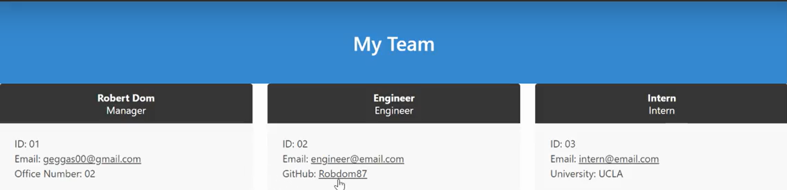

# Team-Profile-Generator

## Description 
The Team Profile Generator is a terminal based application that allows the user to create and fill a template html with different team members. 

 

## Table of Contents

- [Installation](#installation)
- [Usage](#usage)
- [License](#license)

## Installation

Team-Profile-Generator is a terminal based application, requiring it to be downloaded/cloned by the user. 
 
Technologies Used: 
- Javascript
- Html5
- Inquirer
- Jest

## Usage
The program is initialized by "npm run start" in the terminal. The user is then prompted with questions regarding the managers information. Each team has only one manager. After the user inputs all the information, they can choose whether to add an engineer, add an intern, or finish the html. If add an engineer or add an intern is selected, the user is prompted to answer informational questions regarding their selected team member. If the user chooses to finish, the html is created within the dist folder. The generator also comes along with a set of test that validates the functionality of the classes used. The test can be run with 'npm run test'.

[Walk-Thru](https://drive.google.com/file/d/1nARA1useRWGVkeYpWBDLLd5yBDQSOK40/view)

## License

MIT License

Copyright (c) [2022]

Permission is hereby granted, free of charge, to any person obtaining a copy
of this software and associated documentation files (the "Software"), to deal
in the Software without restriction, including without limitation the rights
to use, copy, modify, merge, publish, distribute, sublicense, and/or sell
copies of the Software, and to permit persons to whom the Software is
furnished to do so, subject to the following conditions:

The above copyright notice and this permission notice shall be included in all
copies or substantial portions of the Software.

THE SOFTWARE IS PROVIDED "AS IS", WITHOUT WARRANTY OF ANY KIND, EXPRESS OR
IMPLIED, INCLUDING BUT NOT LIMITED TO THE WARRANTIES OF MERCHANTABILITY,
FITNESS FOR A PARTICULAR PURPOSE AND NONINFRINGEMENT. IN NO EVENT SHALL THE
AUTHORS OR COPYRIGHT HOLDERS BE LIABLE FOR ANY CLAIM, DAMAGES OR OTHER
LIABILITY, WHETHER IN AN ACTION OF CONTRACT, TORT OR OTHERWISE, ARISING FROM,
OUT OF OR IN CONNECTION WITH THE SOFTWARE OR THE USE OR OTHER DEALINGS IN THE
SOFTWARE.